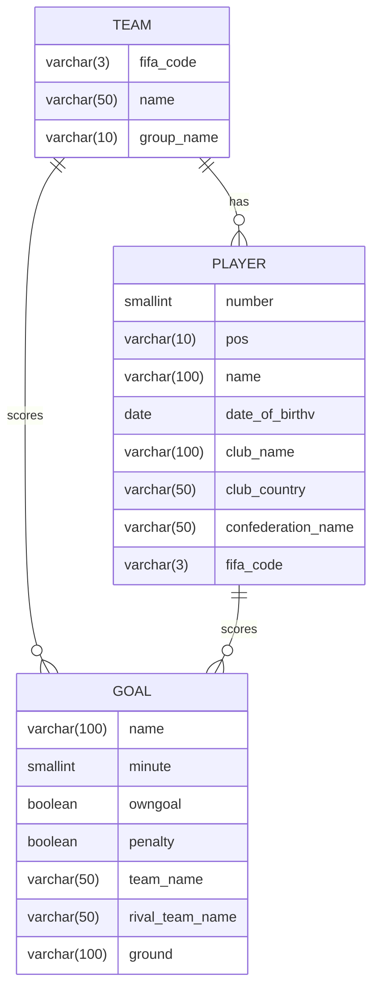

```mermaid
    
    erDiagram

    TEAM ||--o{ PLAYER : "has"
    TEAM ||--o{ GOAL : "scores"
    TEAM {
        varchar(3) fifa_code
        varchar(50) name 
        varchar(10) group_name
    }

    PLAYER ||--o{ GOAL : "scores"
    PLAYER {
        smallint number
        varchar(10) pos
        varchar(100) name
        date date_of_birthv
        varchar(100) club_name
        varchar(50) club_country
        varchar(50) confederation_name
        varchar(3) fifa_code
    }

    GOAL {
        varchar(100) name
        smallint minute
        boolean owngoal
        boolean penalty
        varchar(50) team_name
        varchar(50) rival_team_name
        varchar(100) ground
    }
```